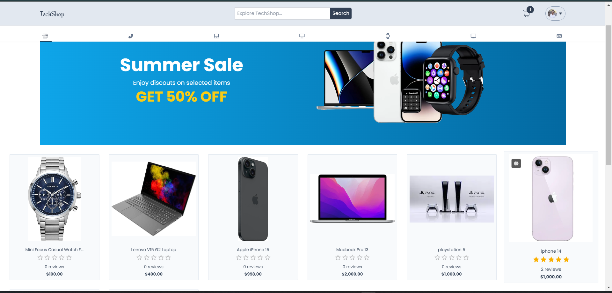
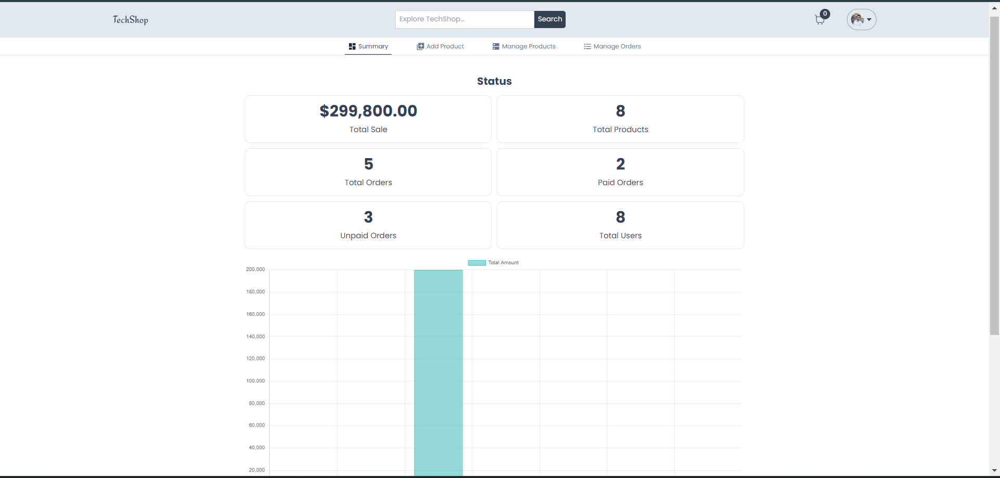

# 🛍️ TechShop – Full-Stack E-Commerce Platform

**Live Demo:** [e-commerce-app-omega-pink.vercel.app](https://e-commerce-app-omega-pink.vercel.app/)  
**GitHub Repo:** [github.com/mostafamohamededrees/E-commerce-app](https://github.com/mostafamohamededrees/E-commerce-app)

---

## 📸 Preview
> 
> 
> 
> 
> 
> 
> 
> 

---

## 🚀 Overview

**TechShop** is a full-stack e-commerce platform for electronics built with **Next.js** and **MongoDB**, providing a smooth shopping experience for both users and admins.  
It includes secure authentication, Stripe payment integration, product management, and a real-time admin dashboard.

---

## ✨ Features

- 🔍 **Product Search & Category Filters** for easy navigation.  
- 🔐 **Secure Authentication** using Email and Google.  
- 💳 **Stripe Integration** for payments with order and status tracking.  
- ⭐ **Verified Buyer Rating System** to ensure authentic feedback.  
- 📦 **Order Tracking** (Dispatched / Delivered).  
- 🧑‍💼 **Admin Dashboard** with live analytics, sales stats, and inventory management.  
- ⚙️ **Role-Based Access Control** (admin-only dashboard).  
- 🌐 **Randomized Product Display** on the homepage for dynamic UX.  
- 📊 **Real-Time Charts** for sales and user insights using Chart.js.  

---

## 🧠 Tech Stack

| Technology | Purpose |
|-------------|----------|
| **Next.js** | Core framework for SSR & routing |
| **React.js** | Frontend UI and interactivity |
| **TypeScript** | Type-safe JavaScript |
| **Tailwind CSS** | Modern UI styling |
| **React Hook Form** | Form handling and validation |
| **Context API** | Global state management |
| **Chart.js** | Data visualization in the dashboard |
| **Stripe** | Payment processing |
| **MongoDB + Prisma** | Database and ORM management |

---

## ⚙️ Installation & Setup

```bash
# Clone the repository
git clone https://github.com/mostafamohamededrees/E-commerce-app.git

# Navigate to the project directory
cd E-commerce-app

# Install dependencies
npm install

# Create your .env file and fill in the required keys (see below)

# Run the development server
npm run dev
